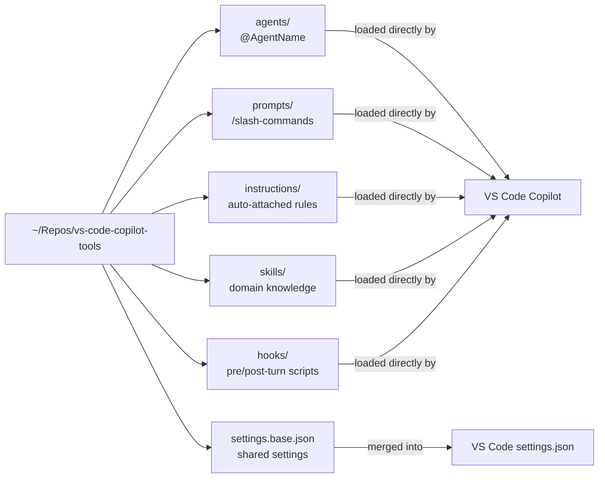

# VS Code Copilot Tools

Shared configuration for VS Code GitHub Copilot across machines — agents, prompts, instructions, skills, and hooks — managed as a git repo so every machine stays in sync automatically.

---

## What's in Here

| Directory | File Type | What It Does |
|-----------|-----------|--------------|
| `agents/` | `*.agent.md` | Custom agents invokable with `@AgentName` |
| `prompts/` | `*.prompt.md` | Slash-command prompts, e.g. `/CreatePlan` |
| `instructions/` | `*.instructions.md` | Auto-attached context rules (e.g. applied to all `*.cs` files) |
| `skills/` | `SKILL.md` subfolders | Domain knowledge packages loaded by agents |
| `hooks/` | `*.json` + `scripts/` | Pre/post-turn automation triggered by tool use |
| `settings.base.json` | — | Shared VS Code Copilot settings, no machine-specific values |

---

## How It Works

VS Code loads each file type from a directory registered in `settings.json`. This repo's directories are registered there so every machine that clones it picks up the same configuration.



---

## First-Time Setup

```powershell
git clone https://github.com/bhanford9/vs-code-copilot-tools "$env:USERPROFILE\Repos\vs-code-copilot-tools"
```

Then use the `merge-copilot-settings` skill (or `/merge-copilot-settings` prompt) to apply `settings.base.json` on top of your local `settings.json`. Reload VS Code when done.

> The repo must live at `~/Repos/vs-code-copilot-tools`. VS Code location settings use `~/` paths, which resolve relative to your home directory.

---

## Ongoing Use

```powershell
# Pick up changes from another machine
git pull --rebase

# Share your changes
git add -A
git commit -m "what changed"
git push
```

Use the `/update-copilot-tools` prompt to pull, analyze what changed, and handle any required follow-up steps automatically.

---

## Self-Perfecting Configuration

Every skill and agent workflow includes a **LessonsLearned feedback loop** — a `LessonsLearned.md` file alongside each `SKILL.md` that accumulates user-specific discoveries across sessions. Agents read it before starting and update it when something notable happens, so the tooling improves without manual refactoring after every session.

Two prompts maintain this loop:

| Prompt | When to use |
|--------|-------------|
| `/fork-and-improve` | Mid-session — something went off the rails. Capture the failure, apply the config fix, write the LessonsLearned entry while context is fresh |
| `/review-lessons` | Periodically — scan all LessonsLearned files across all skills, identify entries that should be promoted to a SKILL.md rule or enforced as a hook, and surface a prioritized action list |

The escalation path keeps passive guidance from staying passive when it keeps failing: a one-off discovery stays in LessonsLearned, a recurring pattern moves into the SKILL.md body, and a pattern that keeps recurring despite being in the skill becomes a hook.

---

## Feature Map

See [FEATURES.md](FEATURES.md) for a conceptual index of every tool — what it does, how to invoke it, and which files it spans — without needing to dig into the directory structure.

---

## What Is Not in This Repo

Machine-local files — logs, session state, runtime config, and machine-specific `settings.json` entries — are intentionally excluded. Only configuration that is meaningful on every machine belongs here.