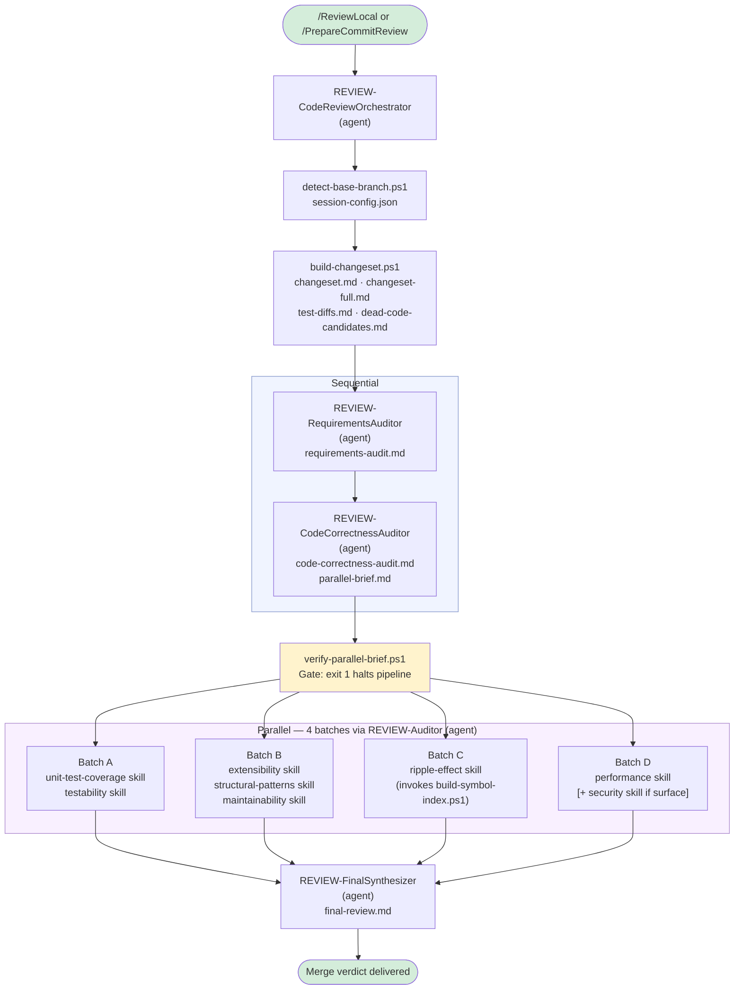

# Code Review Pipeline

A multi-agent code review system that audits code changes across ten quality dimensions — sequentially for requirements and correctness, then in parallel across eight specialized audit dimensions. A final synthesizer consolidates all findings into a merge verdict.

---

## Overview

Two invocation modes are supported:

- **Branch review** (`/ReviewLocal`) — reviews all changes on the current branch since master, including uncommitted modifications
- **Commit review** (`/PrepareCommitReview`) — cherry-picks specific commit SHAs onto an isolated review branch, then runs the same pipeline against them

Both modes converge on the same pipeline entry point: the `REVIEW-CodeReviewOrchestrator` agent.

---

## Architecture

The pipeline has three phases: a sequential phase for requirements and correctness context, a parallel phase where four batches of auditors run simultaneously, and synthesis. PowerShell scripts execute before the agents begin to pre-compute git artifacts that would be expensive for agents to re-derive independently.



---

## Agents vs. Skills: How Responsibilities Are Split

Understanding this distinction is central to reading how the pipeline works.

**Dedicated agents** handle stages where reasoning depth, judgment, and responsibility isolation matter most. Each runs in its own context window with its own system prompt:

| Agent | Role |
|---|---|
| `REVIEW-CodeReviewOrchestrator` | Entry point; runs scripts; orchestrates all stages |
| `REVIEW-RequirementsAuditor` | Extracts requirements; fetches ADO work items; identifies gaps |
| `REVIEW-CodeCorrectnessAuditor` | Verifies functional correctness; writes the parallel-brief handoff |
| `REVIEW-FinalSynthesizer` | Reads all 10 audit reports; resolves conflicts; writes final verdict |

**The generic `REVIEW-Auditor` agent** is a single, reusable batch executor. It has no embedded audit logic of its own — the Orchestrator hands it a list of skill file paths at invocation time, and it reads and executes them in sequence. All four parallel batches use this same agent.

**Auditor skills** are instruction documents (`skills/code-review-pipeline/auditors/{name}/SKILL.md`), not agents. Each skill defines one audit dimension's workflow, output format, finding structure, and LessonsLearned file paths. The generic agent loads them at runtime.

### Why It's Designed This Way

The architecture is primarily driven by token cost.

**Agent system prompts are always loaded.** In VS Code Copilot, every registered agent's configuration is included in the system prompt for every conversation — regardless of whether a review is happening. If each of the eight audit dimensions were its own dedicated agent, all eight instruction sets would be burning tokens on every coding session, every chat, every unrelated task. By storing audit logic in skill files instead, that content is only ever loaded into context when the `REVIEW-Auditor` agent explicitly reads the file during a review run.

**One generic agent instead of eight.** The same cost reasoning applies to the agent definition itself. A single `REVIEW-Auditor` with no embedded audit logic stays lightweight. Audit-specific instructions live in skills and are fetched at runtime when needed.

**Batching preserves shared context across sequential audits.** The four parallel batches are not fully independent — each batch executes two or three skills in sequence within the same context window. This is intentional. Once a batch agent loads the shared Phase 0 context (the parallel brief, changeset summary, report template, and conventions), that context is already in memory for every subsequent skill it runs in that session. Splitting each skill into its own fully independent subagent would require each one to redundantly rebuild the same shared context from scratch, multiplying cost proportionally. Grouping skills into batches amortizes that setup cost across the audits assigned to each batch.

---

## Invocation

### `/ReviewLocal`
Defined in `prompts/ReviewLocal.prompt.md`. Targets the `REVIEW-CodeReviewOrchestrator` agent. Reviews all commits on the current branch since master plus any staged/unstaged changes in the working directory. The common case for pre-merge reviews.

### `/PrepareCommitReview`
Defined in `prompts/PrepareCommitReview.prompt.md`. Targets the same Orchestrator. Accepts a list of commit SHAs, validates them, sorts them chronologically, and cherry-picks them onto an isolated review branch. Then hands off to the same Orchestrator pipeline as `/ReviewLocal`. Use this when reviewing a set of commits that have already merged or that span multiple branches.

---

## Pre-Flight Scripts

Scripts run before any agent audits begin. They convert raw git state into structured artifacts so agents can read pre-computed files rather than each independently issuing git commands and burning context budget on redundant work.

All scripts read `code-review/session-config.json` for shared context (base branch, review mode, security surface flag).

### `detect-base-branch.ps1`
**Produces**: `code-review/session-config.json`

Detects whether the repo's default branch is `main` or `master`. Then scans the changed file list for security-relevant filename patterns (`Controller`, `DbContext`, `Password`, `Authorize`, `SqlCommand`, etc.) — test files excluded to prevent false positives from inherited naming. Writes the result as `securitySurface: true/false` into `session-config.json`. This value is consumed by the Orchestrator to decide whether to include the Security auditor and is trusted unconditionally — not re-evaluated by any downstream agent.

Also reads `review-exclusions.json` from the git common directory (if present) to exclude artifact file types from the security surface scan.

### `build-changeset.ps1`
**Produces**: `changeset.md`, `changeset-full.md`, `test-diffs.md`, `dead-code-candidates.md`, `captive-deps.md` (optional)

The primary artifact-generation script. Builds the stat-level summary (`changeset.md`) used by most agents, and the full enriched diff (`changeset-full.md`) that includes commit messages, diff hunks, and source context — reserved for agents that genuinely need line-level detail. Also slices test file diffs separately into `test-diffs.md` (consumed by Batch A) to avoid forcing the unit test auditor to filter a full mixed diff.

Invokes `build-dead-code-candidates.ps1` and `build-test-index.ps1` as sub-calls. If a workspace-local `check-captive-dependencies.ps1` exists, runs it and captures its output as `captive-deps.md`.

Artifact exclusions are applied here: file extensions and directory trees listed in `review-exclusions.json` are excluded from all diff output, preventing generated files from inflating the changeset.

### `build-dead-code-candidates.ps1`
**Produces**: `code-review/dead-code-candidates.md`

Scans deleted lines in the source diff for C# declaration patterns. For each candidate symbol, runs `git grep` across the production source tree to determine whether any references remain. Produces three categorized sections: **Confirmed Dead** (0 references anywhere), **Test-Only References** (still referenced in test files but not production), and **Still Referenced in Production** (not dead — potential incomplete deletion). Consumed by the Correctness auditor for dead-code correctness bugs and by the Ripple Effect auditor for pre-confirmed propagation gaps.

### `build-test-index.ps1`
**Produces**: Section E of `changeset-full.md`

For each changed source file, resolves the expected test file path using the project naming convention (`MyProject/Foo.cs` → `MyProjectTests/FooTests.cs`), walks up to find the `.csproj` boundary, and checks whether the expected test file exists. Results embedded into `changeset-full.md` so the unit test auditor gets a pre-built coverage gap list rather than deriving it manually.

### `build-symbol-index.ps1`
**Produces**: `code-review/symbol-index.md` (on-demand)

Unlike the others, this script is **not pre-run** by `build-changeset.ps1`. The Ripple Effect auditor invokes it on-demand if `symbol-index.md` doesn't already exist. Extracts all changed public/internal C# declarations from the diff using regex, then runs `git grep` to build a caller reference table: symbol → file:line:content. Gives the Ripple Effect auditor a pre-computed call-site index rather than requiring it to run usages searches for every changed symbol.

### `verify-parallel-brief.ps1`
**Role**: Pipeline gate — exit code 0 continues, exit code 1 halts

Runs immediately after the Correctness Auditor returns. Checks that `code-review/parallel-brief.md` exists, exceeds a minimum byte threshold, and contains the required `## Intent` and `## Key Requirements` sections. If any check fails, the Orchestrator stops the pipeline and reports the failure rather than launching four parallel batches against a broken or empty context handoff. This prevents a single agent failure from silently propagating bad context across all parallel auditors.

---

## Pipeline Stages

### Stage 0 — Initialization
The Orchestrator runs `detect-base-branch.ps1`. The resulting `session-config.json` drives every downstream decision: which base branch to diff against, whether to include the Security auditor, and which review mode (branch vs. single-commit) all subsequent scripts use.

### Stage 1 — Sequential: Requirements
`REVIEW-RequirementsAuditor` runs in isolation. It reads `changeset.md` and uses semantic search to understand what the changes are doing at a domain level. It then invokes the `fetch-azure-devops-work-item` skill to automatically retrieve work item details from Azure DevOps via the configured REST API. If the fetch fails or the repo isn't configured for ADO, it falls back to prompting the user — the only point in the automated pipeline where a user pause is possible.

Findings compare extracted requirements against acceptance criteria: alignments, gaps (requirements not implemented), extras (scope creep), ambiguities, and risks. Output: `requirements-audit.md`.

### Stage 2 — Sequential: Correctness
`REVIEW-CodeCorrectnessAuditor` runs next, after the Requirements Auditor returns. It reads `requirements-audit.md` as its source of truth, then reads `changeset-full.md` for line-level diff context. It reads `dead-code-candidates.md` if present, using the "Still Referenced in Production" section as a pre-confirmed list of incomplete deletions to check for correctness bugs.

The Correctness Auditor writes two output files:
- `code-correctness-audit.md` — its audit findings
- `parallel-brief.md` — a condensed handoff document summarizing intent and key requirements for the parallel batch agents

The parallel brief is what makes the parallel phase cost-efficient: batch agents read it instead of re-reading the full requirements audit or changeset.

### Gate — Parallel Brief Verification
`verify-parallel-brief.ps1` runs. Pass or halt. See [Pre-Flight Scripts](#verify-parallel-briefps1) above.

### Security Routing
The Orchestrator reads `securitySurface` from `session-config.json`. If `false`, it writes a stub `security-audit.md` immediately (status: SKIPPED) and proceeds with 7 auditors. If `true`, the Security auditor is included in Batch D and all 8 run.

### Stage 3 — Parallel: Four Batches
The Orchestrator invokes four `REVIEW-Auditor` instances **simultaneously in a single parallel tool call**. Each runs in its own isolated context window.

Every batch follows the same three-phase execution protocol defined in the `REVIEW-Auditor` agent:

- **Phase 0 — Shared context**: Read `parallel-brief.md`, `changeset.md`, `audit-report-template.md`, and `CONVENTIONS.md`. `changeset-full.md` is explicitly forbidden at this stage — it is 200+ KB and reading it speculatively across four parallel agents would multiply pipeline cost 4–6×. It is only accessed as a targeted last resort for a specific finding.
- **Phase 1 — Planning**: Read each assigned skill file and build an ordered todo list before executing anything.
- **Phase 2 — Sequential execution**: Work through the skill list one at a time. Each skill defines its own workflow, output file, finding format, and LessonsLearned update step. The LessonsLearned step is not optional.

| Batch | Skills Executed (in order) | Output Files |
|---|---|---|
| A | unit-test-coverage → testability | `unit-test-coverage-audit.md`, `testability-audit.md` |
| B | extensibility → structural-patterns → maintainability | `extensibility-audit.md`, `structural-patterns-audit.md`, `maintainability-audit.md` |
| C | ripple-effect | `ripple-effect-audit.md` |
| D | performance [→ security if surface] | `performance-audit.md` [, `security-audit.md`] |

Batch C (Ripple Effect) is the only batch that may invoke a script at runtime — it generates `symbol-index.md` on demand via `build-symbol-index.ps1` if the file isn't already present.

### Stage 4 — Synthesis
`REVIEW-FinalSynthesizer` reads all 10 audit reports. Before writing the final report, it resolves factual conflicts between auditors (e.g., one auditor claims a symbol is dead, another treats it as active) by running a targeted verification rather than accepting either assertion. It applies LessonsLearned suppression to filter out known false positives for the codebase.

Output: `code-review/final-review.md` with a verdict of **PASS**, **MERGE WITH CONDITIONS**, or **BLOCKED**, plus a Critical/High issue count.

---

## Output Artifacts

All files are written to `/code-review/` in the repository being reviewed.

| File | Written By | Read By |
|---|---|---|
| `session-config.json` | `detect-base-branch.ps1` | All scripts; all agents |
| `changeset.md` | `build-changeset.ps1` | Requirements, Correctness, all batch agents |
| `changeset-full.md` | `build-changeset.ps1` | Correctness (default); batch agents (targeted last resort only) |
| `test-diffs.md` | `build-changeset.ps1` | Batch A (unit-test-coverage, testability) |
| `dead-code-candidates.md` | `build-dead-code-candidates.ps1` | Correctness, Ripple Effect |
| `captive-deps.md` | `check-captive-dependencies.ps1` (workspace-local) | Ripple Effect |
| `requirements-audit.md` | `REVIEW-RequirementsAuditor` | Correctness Auditor |
| `code-correctness-audit.md` | `REVIEW-CodeCorrectnessAuditor` | FinalSynthesizer |
| `parallel-brief.md` | `REVIEW-CodeCorrectnessAuditor` | All 4 batch agents (Phase 0) |
| `symbol-index.md` | `build-symbol-index.ps1` (on-demand) | Ripple Effect auditor |
| `unit-test-coverage-audit.md` | Batch A | FinalSynthesizer |
| `testability-audit.md` | Batch A | FinalSynthesizer |
| `extensibility-audit.md` | Batch B | FinalSynthesizer |
| `structural-patterns-audit.md` | Batch B | FinalSynthesizer |
| `maintainability-audit.md` | Batch B | FinalSynthesizer |
| `ripple-effect-audit.md` | Batch C | FinalSynthesizer |
| `performance-audit.md` | Batch D | FinalSynthesizer |
| `security-audit.md` | Batch D (or stub by Orchestrator) | FinalSynthesizer |
| `final-review.md` | `REVIEW-FinalSynthesizer` | Developer (end output) |

---

## LessonsLearned System

Every agent and every auditor skill maintains its own two-tier LessonsLearned files under `skills/code-review-pipeline/lessons-learned/{name}/`:

- **`LessonsLearned.md`** — codebase-specific findings: false positives to suppress, known patterns in the repo, project conventions that affect audit interpretation
- **`LessonsLearned.GLOBAL.md`** — model/process findings that generalize across all repos: synthesis strategies, conflict-resolution patterns, recurring model behaviors

Each auditor reads its own LessonsLearned files before beginning and updates them after completing. The FinalSynthesizer can promote a pipeline-wide finding to the pipeline-level LessonsLearned at `skills/code-review-pipeline/` — but only when it genuinely applies to the whole pipeline, not just synthesis.

This system prevents recurring false positives from generating noise on every review run and captures codebase-specific context that improves audit accuracy over time.

---

## Audit Dimensions Reference

| Dimension | Batch | Key Questions |
|---|---|---|
| Requirements | Sequential | Does the implementation match the stated work item goals and acceptance criteria? |
| Code Correctness | Sequential | Does the code correctly implement the requirements? Are edge cases handled? |
| Unit Test Coverage | A | Are all new/changed code paths covered? Are acceptance criteria tested? |
| Testability | A | Is the new code structured to be testable? Are dependencies injectable? |
| Extensibility | B | Are open/closed and dependency inversion principles followed? |
| Structural Patterns | B | Do the changes follow established patterns in the codebase catalog? |
| Maintainability | B | Is the code readable, appropriately decomposed, and free of duplication? |
| Ripple Effect | C | What was changed but not in the diff — call sites, symmetric paths, companion logic? |
| Performance | D | Are there memory, algorithm, database, or network concerns? |
| Security | D | Are there OWASP Top 10 risks — injection, access control, sensitive data exposure? |

---

## Optional Setup

The pipeline works without any configuration. These two files improve diff quality and audit accuracy when present.

### `review-exclusions.json`
Placed in the git common directory (`git rev-parse --git-common-dir`) so it is shared across all worktrees and never committed. Tells the pre-flight scripts which file extensions and directory paths to exclude from diffs.

```json
{
  "extensionExcludes": ["*.generated.cs", "*.fja"],
  "pathExcludes": ["**/IntegrationTests/**", "**/fixtures/**"]
}
```

A template is available at `skills/code-review-pipeline/review-exclusions.example.json`.

### `check-captive-dependencies.ps1`
A workspace-local script placed at `.github/scripts/check-captive-dependencies.ps1`. Provide this only if your stack has a known captive dependency risk (e.g., Singleton services injecting Scoped dependencies). The script must write its findings to `code-review/captive-deps.md`. The Ripple Effect auditor reads that file if present and treats its contents as confirmed facts rather than re-deriving them.

See `skills/code-review-pipeline/SETUP.md` for the full setup walkthrough.
