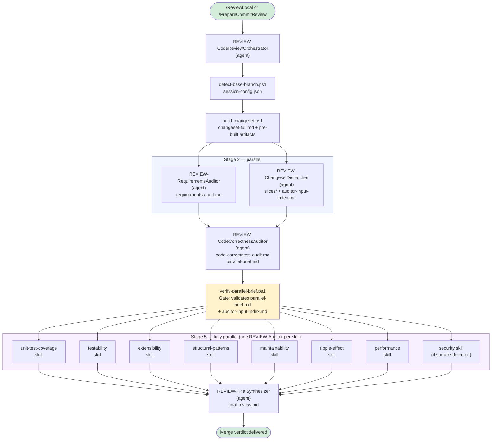

# Code Review Pipeline

A multi-agent code review system that audits code changes across ten quality dimensions. Sequential stages establish requirements and correctness context; a dispatcher pre-processes the changeset into targeted slices; then all auditors run fully in parallel against their individualized input. A final synthesizer consolidates all findings into a merge verdict.

---

## Overview

Two invocation modes are supported:

- **Branch review** (`/ReviewLocal`) — reviews all changes on the current branch since master, including uncommitted modifications
- **Commit review** (`/PrepareCommitReview`) — cherry-picks specific commit SHAs onto an isolated review branch, then runs the same pipeline against them

Both modes converge on the same pipeline entry point: the `REVIEW-CodeReviewOrchestrator` agent.

---

## Architecture

The pipeline has four phases: initialization scripts, a sequential phase for requirements and correctness, a fully parallel phase where every auditor runs independently, and synthesis. The `REVIEW-ChangesetDispatcher` runs during the early parallel block to pre-process the full diff into per-auditor slice files before the parallel auditors launch.



---

## Agents vs. Skills: How Responsibilities Are Split

Understanding this distinction is central to reading how the pipeline works.

**Dedicated agents** handle stages where reasoning depth, judgment, and responsibility isolation matter most. Each runs in its own context window with its own system prompt:

| Agent | Role |
|---|---|
| `REVIEW-CodeReviewOrchestrator` | Entry point; runs scripts; orchestrates all stages |
| `REVIEW-RequirementsAuditor` | Extracts requirements; fetches ADO work items; identifies gaps |
| `REVIEW-ChangesetDispatcher` | Classifies the full diff into per-auditor slices; writes the input index |
| `REVIEW-CodeCorrectnessAuditor` | Verifies functional correctness; writes the parallel-brief handoff |
| `REVIEW-FinalSynthesizer` | Reads all audit reports; resolves conflicts; writes final verdict |

**The generic `REVIEW-Auditor` agent** is a single, reusable executor. It has no embedded audit logic — the Orchestrator tells it which auditor to run at invocation time, and it reads and executes that skill file. Every parallel auditor in Stage 5 is a separate instance of this same agent.

**Auditor skills** are instruction documents (`skills/code-review-pipeline/auditors/{name}/SKILL.md`), not agents. Each skill defines one audit dimension's workflow, output format, finding structure, and LessonsLearned paths. The generic agent loads them at runtime.

### Why It's Designed This Way

The architecture is primarily driven by token cost.

**Agent system prompts are always loaded.** In VS Code Copilot, every registered agent's configuration is included in the system prompt for every conversation — regardless of whether a review is happening. If each of the eight audit dimensions were its own dedicated agent, all eight instruction sets would be burning tokens on every coding session, every chat, every unrelated task. By storing audit logic in skill files instead, that content is only ever loaded into context when the `REVIEW-Auditor` agent explicitly reads the file during a review run.

**One generic agent instead of eight.** The same cost reasoning applies to the agent definition itself. A single `REVIEW-Auditor` with no embedded audit logic stays lightweight. Audit-specific instructions live in skills and are fetched at runtime only when needed.

**Why not batch auditors together anymore?** The V2 architecture batched multiple skills into each of four `REVIEW-Auditor` instances to amortize the cost of loading shared context (the parallel brief, changeset summary, report template, conventions) across sequential skills within a batch. That shared-context loading cost has been eliminated by the Dispatcher: each auditor now receives only its own pre-sliced input rather than the full changeset, so there is no longer a meaningful shared context cost to amortize. Running auditors fully independently is now strictly better — they start simultaneously and finish as soon as their slice is processed, without waiting on any batch sibling.

---

## Invocation

### `/ReviewLocal`
Defined in `prompts/ReviewLocal.prompt.md`. Targets the `REVIEW-CodeReviewOrchestrator` agent. Reviews all commits on the current branch since master plus any staged/unstaged changes in the working directory. The common case for pre-merge reviews.

### `/PrepareCommitReview`
Defined in `prompts/PrepareCommitReview.prompt.md`. Targets the same Orchestrator. Accepts a list of commit SHAs, validates them, sorts them chronologically, and cherry-picks them onto an isolated review branch. Then hands off to the same Orchestrator pipeline as `/ReviewLocal`. Use this when reviewing a set of commits that have already merged or that span multiple branches.

---

## Pre-Flight Scripts

Scripts run before agent stages begin. They convert raw git state into structured artifacts, avoiding the need for agents to independently issue git commands and rebuild the same context.

All scripts read `code-review/session-config.json` for shared state.

### `detect-base-branch.ps1`
**Produces**: `code-review/session-config.json`

Detects whether the repo's default branch is `main` or `master`. Scans the changed file list for security-relevant filename patterns (`Controller`, `DbContext`, `Password`, `Authorize`, `SqlCommand`, etc.) — test files excluded to prevent false positives from inherited naming — and writes `securitySurface: true/false`. Also reads `review-exclusions.json` from the git common directory (if present) to apply artifact exclusions to the security surface scan.

The `securitySurface` value is trusted unconditionally by all downstream stages. No agent re-evaluates it.

### `build-changeset.ps1`
**Produces**: `changeset-full.md`, `test-diffs.md`, `dead-code-candidates.md`, `captive-deps.md` (optional)

Builds the enriched full diff that the Requirements Auditor, Correctness Auditor, and Dispatcher all read. Invokes `build-dead-code-candidates.ps1` as a sub-call to produce a pre-verified dead-code list. If a workspace-local `check-captive-dependencies.ps1` exists, runs it and captures output as `captive-deps.md`. Applies artifact exclusions from `review-exclusions.json` to all diff output.

### `build-dead-code-candidates.ps1`
**Produces**: `code-review/dead-code-candidates.md`

Scans deleted lines in the source diff for C# declaration patterns and checks each symbol for remaining references. Produces three sections: **Confirmed Dead** (0 references), **Test-Only References**, and **Still Referenced in Production** (potential incomplete deletion). Consumed by the Correctness auditor and the Ripple Effect auditor's slice.

### `build-symbol-index.ps1`
**Produces**: `code-review/symbol-index.md` (on-demand)

Not pre-run by `build-changeset.ps1`. The Ripple Effect auditor invokes it on-demand if `symbol-index.md` doesn't already exist. Extracts changed public/internal C# declarations and builds a caller reference table (symbol → file:line:content) via `git grep`.

### `measure-slice-ratio.ps1`
**Used by**: `REVIEW-ChangesetDispatcher` during slice validation

Measures the line-count ratio of a candidate slice file against `changeset-full.md`. The Dispatcher calls this after writing each slice. If `ratio >= 0.75`, the slice is discarded and the auditor is pointed at `changeset-full.md` directly — slicing a file that's already 75%+ of the original provides no meaningful savings.

### `verify-parallel-brief.ps1`
**Role**: Pipeline gate — exit code 0 continues, exit code 1 halts

Runs after the Correctness Auditor returns (Stage 4). Checks that both `parallel-brief.md` and `auditor-input-index.md` exist and meet minimum validity requirements. The brief must contain `## Intent` and `## Key Requirements` sections. If either file is missing or malformed, the Orchestrator halts the pipeline rather than launching auditors against a broken context handoff.

---

## Pipeline Stages

### Stage 0 — Initialization
The Orchestrator runs `detect-base-branch.ps1`, writes `session-config.json`, and reports whether `review-exclusions.json` is configured. Then runs `build-changeset.ps1` to produce the full enriched diff and pre-built artifacts.

### Stage 2 — Requirements Audit + Dispatcher (parallel)
Both subagents launch simultaneously from a single parallel tool call.

**`REVIEW-RequirementsAuditor`** reads `changeset-full.md` and performs semantic analysis to extract domain-level requirements. It invokes the `fetch-azure-devops-work-item` skill to auto-retrieve work item details from Azure DevOps (graceful fallback to prompting the user if not configured — the only point in the automated pipeline where a user pause is possible). Compares extracted requirements against acceptance criteria and writes `requirements-audit.md`.

**`REVIEW-ChangesetDispatcher`** reads `changeset-full.md` and `session-config.json`, then applies a per-auditor relevance table to classify which diff content belongs to each audit dimension. For each auditor, it writes a targeted slice file to `code-review/slices/changeset-{auditor-name}.md` — unless the slice would be ≥75% the size of the full changeset (no meaningful savings), in which case it records the full file path instead. After writing each slice, it calls `measure-slice-ratio.ps1` to confirm the threshold decision. It finishes by writing `code-review/auditor-input-index.md`: a single manifest table that every parallel auditor reads to discover its own input files. The Dispatcher intentionally does not read the requirements audit or any other agent output — its job is purely content classification.

### Stage 3 — Correctness Audit (sequential)
`REVIEW-CodeCorrectnessAuditor` runs after both Stage 2 agents return. It reads `requirements-audit.md` as its source of truth, then reads `changeset-full.md` for full diff context. It uses `dead-code-candidates.md` (if present) to identify incomplete deletions as correctness bugs without re-running searches.

Writes two outputs:
- `code-correctness-audit.md` — its findings
- `parallel-brief.md` — a condensed summary of intent and key requirements used as shared context by all parallel auditors

### Stage 3.5 — Security Routing
The Orchestrator reads `securitySurface` from `session-config.json`. If `false`, it writes a stub `security-audit.md` immediately and the pipeline proceeds with 7 auditors. If `true`, all 8 auditors run.

### Stage 4 — Gate
`verify-parallel-brief.ps1` runs. Validates both `parallel-brief.md` and `auditor-input-index.md`. Pass or halt.

### Stage 5 — Fully Parallel Auditors
The Orchestrator launches 7 (or 8) `REVIEW-Auditor` instances **simultaneously in a single parallel tool call** — one per auditor skill, no batching.

Each instance follows the same execution protocol:

1. **Phase 0 — Input discovery**: Read `auditor-input-index.md` to find its assigned row. Read each file listed in that row: its changeset input (slice or full), `parallel-brief.md`, any pre-built artifacts (e.g., `test-diffs.md` for unit-test-coverage, `dead-code-candidates.md` for ripple-effect). Read `audit-report-template.md` and `CONVENTIONS.md`. Each file is read in a **single call** — chunked reads are explicitly forbidden because each read call is a separate LLM turn that accumulates all prior context, making a 6,000-line file read in 150-line chunks ~20× more expensive than a single read.
2. **Phase 1 — Planning**: Read the assigned skill file; build an ordered todo list.
3. **Phase 2 — Execution**: Execute the skill workflow, write the audit report, complete the LessonsLearned update.

Auditors must use only the changeset input their row specifies. If an auditor believes its slice is missing relevant content, it notes this in its report under a **Dispatcher Coverage Note** — it does not silently fetch `changeset-full.md` to compensate.

| Auditor | Changeset Input | Pre-built Artifacts |
|---|---|---|
| unit-test-coverage | slice or full | `test-diffs.md` (if exists) |
| testability | slice or full | `test-diffs.md` (if exists) |
| extensibility | slice or full | — |
| structural-patterns | slice or full | — |
| maintainability | slice or full | — |
| ripple-effect | slice or full | `dead-code-candidates.md` (if exists) |
| performance | slice or full | — |
| security | slice or full (omitted if no surface) | — |

### Stage 6 — Synthesis
`REVIEW-FinalSynthesizer` reads all audit reports. Before writing the final report, it resolves factual conflicts between auditors (e.g., contradictory dead-code claims) using targeted verification. It applies LessonsLearned suppression for known codebase-specific false positives. Writes `code-review/final-review.md` with a verdict of **PASS**, **MERGE WITH CONDITIONS**, or **BLOCKED** and a Critical/High issue count.

---

## The Dispatcher: How Slicing Works

The `REVIEW-ChangesetDispatcher` is the key new component in this architecture. It solves a specific problem: the full diff may be 200+ KB, but most of that content is irrelevant to any given auditor. Passing the full file to every auditor wastes context and inflates cost.

The Dispatcher applies a per-auditor relevance table to decide what each dimension actually needs:

| Auditor | Included | Excluded |
|---|---|---|
| unit-test-coverage | All production source files + all test files | Non-code assets, configs |
| testability | Production source only (class structure, constructors, DI patterns) | Test files, non-code assets |
| performance | Files with loops, I/O, async, DB/network calls, hot-path allocations | Pure DTOs, config-only files, pure UI |
| extensibility | Interfaces, DI registrations, public signatures, files with OCP/DIP violation signals | Pure behavioral refactors, pure DTOs, test files |
| structural-patterns | Class/interface declarations, constructors, inheritance, DI registrations | Method body internals, test files |
| maintainability | Complete changed method bodies (not just diff lines) | Non-code assets, test files |
| ripple-effect | Files with changed symbol declarations + files referencing those symbols | Files with no symbol overlap |
| security | Auth, input validation, external calls, persistence, encryption | Pure UI, config-only, test files |

The 75% threshold rule prevents wasted effort: if the slice would be nearly as large as the full file, the Dispatcher skips writing the slice and records `changeset-full.md` directly in the index instead. A slice that's 80% of the original is not worth the classification work.

---

## Output Artifacts

All files written to `code-review/` in the repository being reviewed.

| File | Written By | Read By |
|---|---|---|
| `session-config.json` | `detect-base-branch.ps1` | All scripts; all agents |
| `changeset-full.md` | `build-changeset.ps1` | Requirements, Correctness, Dispatcher; auditors whose index row points to it |
| `test-diffs.md` | `build-changeset.ps1` | Dispatcher (for slice building); unit-test-coverage, testability auditors |
| `dead-code-candidates.md` | `build-dead-code-candidates.ps1` | Correctness; ripple-effect auditor |
| `captive-deps.md` | `check-captive-dependencies.ps1` (workspace-local) | Ripple Effect auditor |
| `requirements-audit.md` | `REVIEW-RequirementsAuditor` | Correctness Auditor |
| `code-correctness-audit.md` | `REVIEW-CodeCorrectnessAuditor` | FinalSynthesizer |
| `parallel-brief.md` | `REVIEW-CodeCorrectnessAuditor` | All parallel auditors (via index row) |
| `auditor-input-index.md` | `REVIEW-ChangesetDispatcher` | All parallel auditors (Phase 0) |
| `slices/changeset-{name}.md` | `REVIEW-ChangesetDispatcher` | The named auditor (via index row) |
| `symbol-index.md` | `build-symbol-index.ps1` (on-demand) | Ripple Effect auditor |
| `unit-test-coverage-audit.md` | `REVIEW-Auditor` (unit-test-coverage) | FinalSynthesizer |
| `testability-audit.md` | `REVIEW-Auditor` (testability) | FinalSynthesizer |
| `extensibility-audit.md` | `REVIEW-Auditor` (extensibility) | FinalSynthesizer |
| `structural-patterns-audit.md` | `REVIEW-Auditor` (structural-patterns) | FinalSynthesizer |
| `maintainability-audit.md` | `REVIEW-Auditor` (maintainability) | FinalSynthesizer |
| `ripple-effect-audit.md` | `REVIEW-Auditor` (ripple-effect) | FinalSynthesizer |
| `performance-audit.md` | `REVIEW-Auditor` (performance) | FinalSynthesizer |
| `security-audit.md` | `REVIEW-Auditor` (security) or Orchestrator stub | FinalSynthesizer |
| `final-review.md` | `REVIEW-FinalSynthesizer` | Developer (end output) |

---

## LessonsLearned System

Every agent and every auditor skill maintains its own two-tier LessonsLearned files under `skills/code-review-pipeline/lessons-learned/{name}/`:

- **`LessonsLearned.md`** — codebase-specific findings: false positives to suppress, known patterns in the repo, project conventions that affect audit interpretation
- **`LessonsLearned.GLOBAL.md`** — model/process findings that generalize across all repos

Each auditor reads its own LessonsLearned before beginning and updates them after completing. The FinalSynthesizer can promote a pipeline-wide finding to the pipeline-level LessonsLearned at `skills/code-review-pipeline/` when it genuinely applies to the whole pipeline.

---

## Audit Dimensions Reference

| Dimension | Key Questions |
|---|---|
| Requirements | Does the implementation match the stated work item goals and acceptance criteria? |
| Code Correctness | Does the code correctly implement the requirements? Are edge cases handled? |
| Unit Test Coverage | Are all new/changed code paths covered? Are acceptance criteria tested? |
| Testability | Is the new code structured to be testable? Are dependencies injectable? |
| Extensibility | Are open/closed and dependency inversion principles followed? |
| Structural Patterns | Do the changes follow established patterns in the codebase catalog? |
| Maintainability | Is the code readable, appropriately decomposed, and free of duplication? |
| Ripple Effect | What was changed but not in the diff — call sites, symmetric paths, companion logic? |
| Performance | Are there memory, algorithm, database, or network concerns? |
| Security | Are there OWASP Top 10 risks — injection, access control, sensitive data exposure? |

---

## Optional Setup

The pipeline works without any configuration. These two files improve diff quality and audit accuracy when present.

### `review-exclusions.json`
Placed in the git common directory (`git rev-parse --git-common-dir`) so it is shared across all worktrees and never committed. Tells the pre-flight scripts which file extensions and directory paths to exclude from diffs.

```json
{
  "extensionExcludes": ["*.generated.cs", "*.fja"],
  "pathExcludes": ["**/IntegrationTests/**", "**/fixtures/**"]
}
```

A template is available at `skills/code-review-pipeline/review-exclusions.example.json`.

### `check-captive-dependencies.ps1`
A workspace-local script placed at `.github/scripts/check-captive-dependencies.ps1`. Provide this only if your stack has a known captive dependency risk (e.g., Singleton services injecting Scoped dependencies). The script must write its findings to `code-review/captive-deps.md`. The Ripple Effect auditor reads that file if present and treats its contents as confirmed facts rather than re-deriving them.

See `skills/code-review-pipeline/SETUP.md` for the full setup walkthrough.
