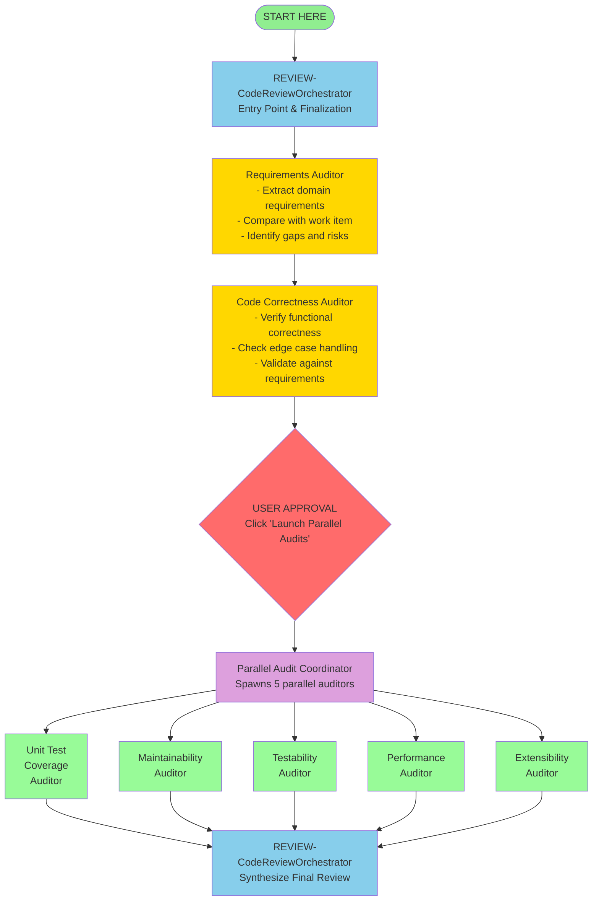

# Code Review Agent Pipeline

A comprehensive multi-agent code review system for GitHub Copilot in VS Code that provides deep, specialized analysis of code changes through coordinated auditors.

## Overview

This pipeline analyzes code changes from the master branch through a series of sequential and parallel audits, culminating in a unified final review report. Each audit is performed by a specialized agent focusing on a specific quality dimension.

The pipeline supports two review modes:
1. **Local Branch Review** - Review all changes on current branch vs master (includes uncommitted changes)
2. **Commit List Review** - Review a specific set of commits as a combined changeset

## Pipeline Architecture



## Agents

### REVIEW-CodeReviewOrchestrator
**File**: `REVIEW-CodeReviewOrchestrator.agent.md`

Entry point and final synthesizer. Guides users through the review process and combines all audit outputs into a comprehensive final review.

**When to use**: Start every code review here

### Requirements Auditor
**File**: `REVIEW-RequirementsAuditor.agent.md`

Analyzes code changes to extract domain-level requirements, compares with work item acceptance criteria, and identifies gaps or scope concerns.

**Outputs**: `/code-review/requirements-audit.md`

### Code Correctness Auditor
**File**: `REVIEW-CodeCorrectnessAuditor.agent.md`

Verifies the implementation correctly achieves requirements, validates edge case handling, and ensures functional correctness.

**Outputs**: `/code-review/code-correctness-audit.md`

### Parallel Audit Coordinator
**File**: `REVIEW-ParallelAuditCoordinator.agent.md`

Orchestrates simultaneous execution of all five parallel auditors by launching them as parallel subagents within the editor session.

**How it works**:
- Launches each auditor as a named subagent using the `agent` tool
- All 5 run as parallel subagents in isolated context windows
- Waits for all 5 to complete and return their results
- Reports results and offers handoff to final synthesis
- Uses the `agents` frontmatter property to restrict available subagents to the 5 auditors

**Invoked by**: User clicking "Launch Parallel Audits" handoff

### Unit Test Coverage Auditor
**File**: `REVIEW-UnitTestCoverageAuditor.agent.md`

Evaluates test completeness, quality, and coverage. Ensures all code paths, requirements, and edge cases are tested.

**Outputs**: `/code-review/unit-test-coverage-audit.md`

**Focus**:
- Code path coverage
- Requirement verification
- Edge case testing
- Test quality and assertions
- Parameter verification through call chains

### Maintainability Auditor
**File**: `REVIEW-MaintainabilityAuditor.agent.md`

Assesses code readability, design principles (SRP, KISS, YAGNI), and long-term maintainability.

**Outputs**: `/code-review/maintainability-audit.md`

**Focus**:
- Readability and naming
- Single Responsibility Principle
- Modularity and coupling
- Unnecessary complexity
- Dependency hygiene

### Testability Auditor
**File**: `REVIEW-TestabilityAuditor.agent.md`

Evaluates how easy the code is to test, focusing on dependency injection, complexity, and design patterns.

**Outputs**: `/code-review/testability-audit.md`

**Focus**:
- Dependency injection boundaries
- External dependencies behind adapters
- Method complexity
- Law of Demeter
- Observable outcomes

### Performance Auditor
**File**: `REVIEW-PerformanceAuditor.agent.md`

Identifies performance concerns in memory usage, algorithms, concurrency, and database operations.

**Outputs**: `/code-review/performance-audit.md`

**Focus**:
- Memory efficiency and leaks
- Algorithmic complexity (Big-O)
- Network and concurrency patterns
- Database query optimization

### Extensibility Auditor
**File**: `REVIEW-ExtensibilityAuditor.agent.md`

Assesses future adaptability, design patterns, and ability to accommodate changing requirements.

**Outputs**: `/code-review/extensibility-audit.md`

**Focus**:
- Open/Closed Principle
- Dependency Inversion
- Extension points
- Coupling and cohesion
- Configuration vs code
- API evolution strategy

## Usage

### Review Mode 1: Local Branch Review

This is the default mode for reviewing all changes on your current branch.

1. **Invoke the REVIEW-CodeReviewOrchestrator agent** using `ReviewLocal.prompt.md`
2. The orchestrator will verify git context and show what changes will be reviewed
3. **Click "Start Requirements Audit"** handoff to begin the pipeline

### Review Mode 2: Commit List Review

Use this mode to review a specific set of commits (e.g., from different branches or non-contiguous commits).

#### Step 1: Prepare Commits for Review

1. **Invoke the Implementation agent** using `PrepareCommitReview.prompt.md`
2. The agent will ask you for:
   - List of commit SHAs to review
   - Baseline branch (default: master)
   - Conflict strategy (abort/skip/theirs/ours)
3. The agent will:
   - Create a temporary review branch
   - Cherry-pick the selected commits
   - Handle any conflicts according to your strategy
   - Save configuration for cleanup later

#### Step 2: Run Code Review

4. **After preparation completes**, invoke `ReviewLocal.prompt.md` to start the review
5. The review will analyze the temporary branch vs baseline
6. Follow the normal review pipeline (see Sequential Phase below)

#### Step 3: Cleanup After Review

7. **After review is complete**, invoke `CleanupCommitReview.prompt.md`
8. The cleanup agent will:
   - Return to your original branch
   - Delete the temporary review branch
   - Remove configuration files
   - Optionally preserve or delete review reports

### Common Review Workflow (Both Modes)

#### Sequential Phase

**Requirements Auditor** will:
   - Analyze all changes since master branch
   - Extract domain-level requirements
   - Ask you for work item details (title, description, acceptance criteria)
   - Compare code changes with work item requirements
   - Create `/code-review/requirements-audit.md`
   - Offer handoff to Code Correctness Auditor

**Code Correctness Auditor** will:
   - Read the requirements audit
   - Verify functional correctness
   - Check edge case handling
   - Validate against requirements
   - Create `/code-review/code-correctness-audit.md`
   - Offer "Launch Parallel Audits" handoff

#### Parallel Phase

**When ready** (after reviewing correctness audit), **click "Launch Parallel Audits"**

**Parallel Audit Coordinator** will:
   - Launch all 5 parallel auditors as subagents in a single parallel batch
   - Each auditor runs in its own isolated context window via the `agent` tool
   - All 5 run simultaneously as parallel subagents within the editor session
   - Coordinator waits for all 5 to complete and return their results
   - Each auditor independently creates its own report in `/code-review/`
   - Coordinator reports results and offers handoff to final synthesis

#### Finalization

**After all parallel audits complete** (the coordinator will confirm this), **click "Generate Final Review"** handoff

**Orchestrator** will:
   - Read all 7 audit reports
   - Synthesize findings across all dimensions
   - Create `/code-review/final-review.md` with:
     - Executive summary
     - Issues prioritized by severity
     - What's done well
     - Summary by category
     - Merge recommendation
     - Actionable next steps

## Output Directory

All audit reports are written to: **`/code-review/`**

This directory is created automatically if it doesn't exist. Files are overwritten on subsequent reviews.

### Output Files

- `requirements-audit.md` - Requirements analysis
- `code-correctness-audit.md` - Functional correctness
- `unit-test-coverage-audit.md` - Test coverage analysis
- `maintainability-audit.md` - Code quality assessment
- `testability-audit.md` - Testability analysis
- `performance-audit.md` - Performance concerns
- `extensibility-audit.md` - Future adaptability
- `final-review.md` - Synthesized comprehensive review

## Severity Levels

All audits use consistent severity levels:

- **🔴 Critical** - Must fix before merge; blocks functionality or causes data loss
- **🟠 High** - Should fix before merge; significant impact
- **🟡 Medium** - Should address soon; affects code quality
- **🟢 Low** - Nice to have; minor improvements

## Git Scope

All auditors analyze **changes since the latest master branch**, including:
- All commits on the current branch
- Staged changes
- Unstaged changes

This supports trunk-based development workflows.

## Conventions

All agents follow shared conventions defined in `code-review-conventions.md`:
- Standardized output format
- Consistent severity levels
- Actionable recommendations
- Positive feedback alongside issues
- File/line references with markdown links

## Customization

### Adding New Auditors

To add a new specialized auditor:

1. Create `REVIEW-{Name}Auditor.agent.md`
2. Follow the pattern of existing auditors
3. Add to `REVIEW-ParallelAuditCoordinator` spawn list (if parallel) or as new handoff (if sequential)
4. Update `REVIEW-CodeReviewOrchestrator` to read the new audit output
5. Add output file to this README

### Modifying Audit Focus

Each auditor has:
- `<workflow>` section defining the audit process
- `<audit_report_template>` defining output structure
- `<audit_principles>` defining evaluation criteria
- `<interaction_style>` defining tone and approach

Edit these sections to adjust audit focus or depth.

## Best Practices

### For Reviewers

- **Complete sequential audits first** - Requirements and Correctness audits provide context for parallel audits
- **Review individual audits** before final synthesis to understand specific concerns
- **Provide context** - Help Requirements Auditor by providing clear work item details
- **Use iterative feedback** - Auditors can re-run after fixes

### For Development Teams

- **Run early and often** - Don't wait until PR is "done"
- **Focus on critical/high issues** - Medium/low can be addressed over time
- **Celebrate strengths** - Audits highlight good practices too
- **Learn from patterns** - Use findings to improve future code
- **Customize severity** - Adjust conventions if team has different priorities

## Agent Configuration

All agents use YAML frontmatter for configuration:

```yaml
---
name: AgentName
description: Brief description
argument-hint: What to tell users to provide
tools: ['search', 'read', 'edit', 'agent', 'search/changes']
handoffs:
  - label: Handoff Label
    agent: TargetAgent
    prompt: Instructions for target agent
    send: false
---
```

## Troubleshooting

### Local Branch Review Issues

**Auditor doesn't find changes**
- Ensure you're in a git repository
- Verify master branch exists (`git branch -a`)
- Check for uncommitted changes (`git status`)

**Parallel audits incomplete**
- Check if REVIEW-ParallelAuditCoordinator completed successfully
- If a subagent fails, the coordinator reports which ones succeeded and which failed
- Individual auditors can be invoked manually to re-run failed audits
- Review `/code-review/` directory to see which reports exist

**Final review missing content**
- Ensure all 7 audit files exist in `/code-review/`
- Check that audits completed (files aren't empty)
- Re-run Orchestrator synthesis if needed

### Commit List Review Issues

For troubleshooting commit list reviews, see [README-CommitReview.md](../../prompts/README-CommitReview.md) which covers:
- Conflict resolution strategies
- Cleanup failures
- Missing configuration files
- Invalid commit SHAs

## Additional Resources

- **[README-CommitReview.md](../../prompts/README-CommitReview.md)** - Detailed guide for commit list review workflow
- **[code-review-conventions.md](code-review-conventions.md)** - Shared conventions used by all auditors
- **Individual agent files** - `REVIEW-*.agent.md` for specific auditor details

## Future Enhancements

Potential additions to the pipeline:

- **Security Auditor** - Vulnerability scanning, auth/authz checks
- **Accessibility Auditor** - UI accessibility compliance
- **Documentation Auditor** - API docs, code comments, README updates
- **Dependency Auditor** - License compliance, vulnerability scanning
- **Architecture Auditor** - Architectural decision compliance
- **Diff-based incremental audits** - Only audit changed sections

---

*For detailed information on each agent's capabilities and audit criteria, see the individual agent markdown files.*
