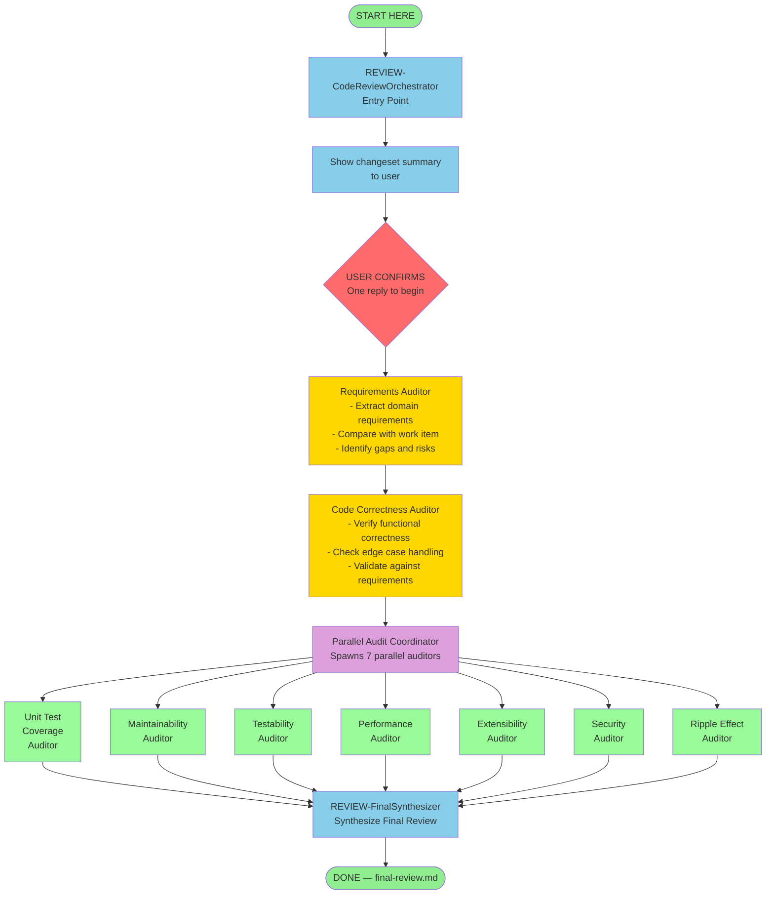

# Code Review Agent Pipeline

A comprehensive multi-agent code review system for GitHub Copilot in VS Code that provides deep, specialized analysis of code changes through coordinated auditors.

## Overview

This pipeline analyzes code changes from the master branch through a series of sequential and parallel audits, culminating in a unified final review report. Each audit is performed by a specialized agent focusing on a specific quality dimension.

The pipeline supports two review modes:
1. **Local Branch Review** - Review all changes on current branch vs master (includes uncommitted changes)
2. **Commit List Review** - Review a specific set of commits as a combined changeset

## Pipeline Architecture


```mermaid
flowchart TD
    Start([START HERE]) --> Orchestrator1[REVIEW-CodeReviewOrchestrator<br/>Entry Point]
    Orchestrator1 --> ShowScope[Show changeset summary<br/>to user]
    ShowScope --> UserConfirm{USER CONFIRMS<br/>One reply to begin}
    UserConfirm --> Requirements[Requirements Auditor<br/>- Extract domain requirements<br/>- Compare with work item<br/>- Identify gaps and risks]
    Requirements --> Correctness[Code Correctness Auditor<br/>- Verify functional correctness<br/>- Check edge case handling<br/>- Validate against requirements]
    Correctness --> Coordinator[Parallel Audit Coordinator<br/>Spawns 7 parallel auditors]
    
    Coordinator --> UnitTest[Unit Test<br/>Coverage<br/>Auditor]
    Coordinator --> Maintainability[Maintainability<br/>Auditor]
    Coordinator --> Testability[Testability<br/>Auditor]
    Coordinator --> Performance[Performance<br/>Auditor]
    Coordinator --> Extensibility[Extensibility<br/>Auditor]
    Coordinator --> Security[Security<br/>Auditor]
    Coordinator --> RippleEffect[Ripple Effect<br/>Auditor]
    
    UnitTest --> FinalSynth[REVIEW-FinalSynthesizer<br/>Synthesize Final Review]
    Maintainability --> FinalSynth
    Testability --> FinalSynth
    Performance --> FinalSynth
    Extensibility --> FinalSynth
    Security --> FinalSynth
    RippleEffect --> FinalSynth
    
    FinalSynth --> Done([DONE — final-review.md])
    
    style Start fill:#90EE90
    style Orchestrator1 fill:#87CEEB
    style ShowScope fill:#87CEEB
    style UserConfirm fill:#FF6B6B
    style Requirements fill:#FFD700
    style Correctness fill:#FFD700
    style Coordinator fill:#DDA0DD
    style UnitTest fill:#98FB98
    style Maintainability fill:#98FB98
    style Testability fill:#98FB98
    style Performance fill:#98FB98
    style Extensibility fill:#98FB98
    style Security fill:#98FB98
    style RippleEffect fill:#98FB98
    style FinalSynth fill:#87CEEB
    style Done fill:#90EE90
```

## Agents

### REVIEW-CodeReviewOrchestrator
**File**: `REVIEW-CodeReviewOrchestrator.agent.md`

Entry point for all reviews. Shows the changeset summary, waits for a single user confirmation, then automatically runs the full pipeline end-to-end (Requirements → Correctness → Parallel Audits → Final Synthesis) with no further user interaction required.

**When to use**: Start every code review here

### REVIEW-FinalSynthesizer
**File**: `REVIEW-FinalSynthesizer.agent.md`

Reads all 9 audit reports, applies patterns from LessonsLearned, and synthesizes a unified final review with merge recommendation.

**Outputs**: `/code-review/final-review.md`  
**Invoked by**: Orchestrator as a subagent after all parallel audits complete

### Requirements Auditor
**File**: `REVIEW-RequirementsAuditor.agent.md`

Analyzes code changes to extract domain-level requirements, compares with work item acceptance criteria, and identifies gaps or scope concerns.

**Outputs**: `/code-review/requirements-audit.md`

### Code Correctness Auditor
**File**: `REVIEW-CodeCorrectnessAuditor.agent.md`

Verifies the implementation correctly achieves requirements, validates edge case handling, and ensures functional correctness.

**Outputs**: `/code-review/code-correctness-audit.md`

### Parallel Audit Coordinator
**File**: `REVIEW-ParallelAuditCoordinator.agent.md`

Orchestrates simultaneous execution of all seven parallel auditors by launching them as parallel subagents within the editor session.

**How it works**:
- Launches each auditor as a named subagent using the `agent` tool
- All 7 run as parallel subagents in isolated context windows
- Waits for all 7 to complete and return their results
- Reports results and returns to the Orchestrator
- Uses the `agents` frontmatter property to restrict available subagents to the 7 auditors

**Invoked by**: Orchestrator as a subagent after Correctness Audit completes

### Unit Test Coverage Auditor
**File**: `REVIEW-UnitTestCoverageAuditor.agent.md`

Evaluates test completeness, quality, and coverage. Ensures all code paths, requirements, and edge cases are tested.

**Outputs**: `/code-review/unit-test-coverage-audit.md`

**Focus**:
- Code path coverage
- Requirement verification
- Edge case testing
- Test quality and assertions
- Parameter verification through call chains

### Maintainability Auditor
**File**: `REVIEW-MaintainabilityAuditor.agent.md`

Assesses code readability, design principles (SRP, KISS, YAGNI), and long-term maintainability.

**Outputs**: `/code-review/maintainability-audit.md`

**Focus**:
- Readability and naming
- Single Responsibility Principle
- Modularity and coupling
- Unnecessary complexity
- Dependency hygiene

### Testability Auditor
**File**: `REVIEW-TestabilityAuditor.agent.md`

Evaluates how easy the code is to test, focusing on dependency injection, complexity, and design patterns.

**Outputs**: `/code-review/testability-audit.md`

**Focus**:
- Dependency injection boundaries
- External dependencies behind adapters
- Method complexity
- Law of Demeter
- Observable outcomes

### Performance Auditor
**File**: `REVIEW-PerformanceAuditor.agent.md`

Identifies performance concerns in memory usage, algorithms, concurrency, and database operations.

**Outputs**: `/code-review/performance-audit.md`

**Focus**:
- Memory efficiency and leaks
- Algorithmic complexity (Big-O)
- Network and concurrency patterns
- Database query optimization

### Extensibility Auditor
**File**: `REVIEW-ExtensibilityAuditor.agent.md`

Assesses future adaptability, design patterns, and ability to accommodate changing requirements.

**Outputs**: `/code-review/extensibility-audit.md`

**Focus**:
- Open/Closed Principle
- Dependency Inversion
- Extension points
- Coupling and cohesion
- Configuration vs code
- API evolution strategy

### Security Auditor
**File**: `REVIEW-SecurityAuditor.agent.md`

Identifies security vulnerabilities including OWASP Top 10 risks, injection vectors, broken access control, sensitive data exposure, and insecure defaults.

**Outputs**: `/code-review/security-audit.md`

**Focus**:
- Injection risks (SQL, command, path, template, expression)
- Broken access control and IDOR
- Sensitive data in logs, serialization, error messages
- Cryptographic weaknesses
- Input validation at system boundaries
- Security misconfiguration and insecure defaults
- Authentication bypass

### Ripple Effect Auditor
**File**: `REVIEW-RippleEffectAuditor.agent.md`

Finds what *wasn't* in the diff but should have been — call sites with stale assumptions, symmetric paths updated asymmetrically, and companion logic silently left behind.

**Outputs**: `/code-review/ripple-effect-audit.md`

**Focus**:
- Call site completeness (callers that now carry wrong assumptions)
- Symmetric path pairs (reader/writer, encoder/decoder, version branches, create/update)
- Companion logic (mappers, DTOs, test reference data, config, documentation)
- Implicit contracts between components only partially honored
- Dead activation paths introduced by the change

## Usage

### Review Mode 1: Local Branch Review

This is the default mode for reviewing all changes on your current branch.

1. **Invoke the REVIEW-CodeReviewOrchestrator agent**
2. The orchestrator shows the changeset summary (commits, files, uncommitted changes)
3. **Reply once to confirm** — the full pipeline then runs automatically end-to-end with no further clicks required
4. When done, `final-review.md` is available in `/code-review/`

### Review Mode 2: Commit List Review

Use this mode to review a specific set of commits (e.g., from different branches or non-contiguous commits).

#### Step 1: Prepare Commits for Review

1. **Invoke the Implementation agent** using `PrepareCommitReview.prompt.md`
2. The agent will ask you for:
   - List of commit SHAs to review
   - Baseline branch (default: master)
   - Conflict strategy (abort/skip/theirs/ours)
3. The agent will:
   - Create a temporary review branch
   - Cherry-pick the selected commits
   - Handle any conflicts according to your strategy
   - Save configuration for cleanup later

#### Step 2: Run Code Review

4. **After preparation completes**, invoke `ReviewLocal.prompt.md` to start the review
5. The review will analyze the temporary branch vs baseline
6. Follow the normal review pipeline (see Sequential Phase below)

#### Step 3: Cleanup After Review

7. **After review is complete**, invoke `CleanupCommitReview.prompt.md`
8. The cleanup agent will:
   - Return to your original branch
   - Delete the temporary review branch
   - Remove configuration files
   - Optionally preserve or delete review reports

### Common Review Workflow (Both Modes)

The pipeline runs fully automatically after a single user confirmation. No handoff buttons to click.

**Stage 1 — Requirements Audit (automatic)**
- Analyzes all changes since master branch
- Extracts domain-level requirements
- Fetches work item details from Azure DevOps (if configured) or prompts once if fetch fails
- Creates `/code-review/requirements-audit.md`

**Stage 2 — Code Correctness Audit (automatic)**
- Reads the requirements audit
- Verifies functional correctness and edge cases
- Creates `/code-review/code-correctness-audit.md`

**Stage 3 — Parallel Audits (automatic, 7 auditors run simultaneously)**
- Parallel Audit Coordinator launches all 7 auditors at once
- Each runs in an isolated context window
- Creates 7 reports in `/code-review/`

**Stage 4 — Final Synthesis (automatic)**
- Reads all 9 audit reports
- Synthesizes findings, resolves conflicts between auditors
- Creates `/code-review/final-review.md` with merge verdict

## Output Directory

All audit reports are written to: **`/code-review/`**

This directory is created automatically if it doesn't exist. Files are overwritten on subsequent reviews.

### Output Files

- `requirements-audit.md` - Requirements analysis
- `code-correctness-audit.md` - Functional correctness
- `unit-test-coverage-audit.md` - Test coverage analysis
- `maintainability-audit.md` - Code quality assessment
- `testability-audit.md` - Testability analysis
- `performance-audit.md` - Performance concerns
- `extensibility-audit.md` - Future adaptability
- `security-audit.md` - Security vulnerabilities
- `ripple-effect-audit.md` - Incomplete propagation and missing companion logic
- `final-review.md` - Synthesized comprehensive review

## Severity Levels

All audits use consistent severity levels:

- **🔴 Critical** - Must fix before merge; blocks functionality or causes data loss
- **🟠 High** - Should fix before merge; significant impact
- **🟡 Medium** - Should address soon; affects code quality
- **🟢 Low** - Nice to have; minor improvements

## Git Scope

All auditors analyze **changes since the latest master branch**, including:
- All commits on the current branch
- Staged changes
- Unstaged changes

This supports trunk-based development workflows.

## LessonsLearned Structure

The code review pipeline uses a per-auditor LessonsLearned architecture to prevent cross-contamination of agent-specific findings:

```
skills/code-review-pipeline/
  LessonsLearned.GLOBAL.md          ← Pipeline-level (Orchestrator, Coordinator,
                                       RequirementsAuditor, CorrectnessAuditor)
  lessons-learned/
    REVIEW-MaintainabilityAuditor/
      LessonsLearned.GLOBAL.md      ← Maintainability-specific findings
    REVIEW-TestabilityAuditor/
      LessonsLearned.GLOBAL.md
    REVIEW-PerformanceAuditor/
      LessonsLearned.GLOBAL.md
    REVIEW-ExtensibilityAuditor/
      LessonsLearned.GLOBAL.md
    REVIEW-UnitTestCoverageAuditor/
      LessonsLearned.GLOBAL.md
    REVIEW-SecurityAuditor/
      LessonsLearned.GLOBAL.md
    REVIEW-RippleEffectAuditor/
      LessonsLearned.GLOBAL.md
    REVIEW-FinalSynthesizer/
      LessonsLearned.GLOBAL.md      ← Synthesis-specific findings
```

Each parallel auditor reads and writes only its own directory. The FinalSynthesizer reads all 8 per-auditor files plus the pipeline-level file, and promotes broadly applicable findings to the pipeline level.

## Conventions

All agents follow shared conventions at runtime via the auto-injected `REVIEW-CONVENTIONS.instructions.md` (applied to all files via `applyTo: "**"`). The source of truth for those conventions is documented in [code-review-conventions.md](code-review-conventions.md):
- Standardized output format
- Consistent severity levels
- Actionable recommendations
- Positive feedback alongside issues
- File/line references with markdown links

## Customization

### Adding New Auditors

To add a new specialized auditor:

1. Create `REVIEW-{Name}Auditor.agent.md` with `user-invocable: false`
2. Follow the pattern of existing auditors (workflow, audit_report_template, conventions sections)
3. Create a `LessonsLearned.GLOBAL.md` in `skills/code-review-pipeline/lessons-learned/REVIEW-{Name}Auditor/`
4. Add to `REVIEW-ParallelAuditCoordinator` — both the `agents:` frontmatter list and the subagent invocation instructions
5. Add to `REVIEW-CodeReviewOrchestrator` — the `agents:` frontmatter list
6. Update `REVIEW-FinalSynthesizer` — add the LL read in step 0 and the report file in step 1
7. Update `SKILL.md` — agent roles table and LL directory tree
8. Update `CONVENTIONS.md` — file naming section
9. Update this document

### Modifying Audit Focus

Each auditor has:
- `<workflow>` section defining the audit process
- `<audit_report_template>` defining output structure
- `<audit_principles>` defining evaluation criteria
- `<interaction_style>` defining tone and approach

Edit these sections to adjust audit focus or depth.

## Best Practices

### For Reviewers

- **Complete sequential audits first** - Requirements and Correctness audits provide context for parallel audits
- **Review individual audits** before final synthesis to understand specific concerns
- **Provide context** - Help Requirements Auditor by providing clear work item details
- **Use iterative feedback** - Auditors can re-run after fixes

### For Development Teams

- **Run early and often** - Don't wait until PR is "done"
- **Focus on critical/high issues** - Medium/low can be addressed over time
- **Celebrate strengths** - Audits highlight good practices too
- **Learn from patterns** - Use findings to improve future code
- **Customize severity** - Adjust conventions if team has different priorities

## Agent Configuration

All agents use YAML frontmatter for configuration:

```yaml
---
name: AgentName
description: Brief description
argument-hint: What to tell users to provide
tools: ['search', 'read', 'edit', 'agent', 'search/changes']
handoffs:
  - label: Handoff Label
    agent: TargetAgent
    prompt: Instructions for target agent
    send: false
---
```

## Troubleshooting

### Local Branch Review Issues

**Auditor doesn't find changes**
- Ensure you're in a git repository
- Verify master branch exists (`git branch -a`)
- Check for uncommitted changes (`git status`)

**Parallel audits incomplete**
- Check if REVIEW-ParallelAuditCoordinator completed successfully
- If a subagent fails, the coordinator reports which ones succeeded and which failed
- Individual auditors can be invoked manually to re-run failed audits
- Review `/code-review/` directory to see which reports exist

**Final review missing content**
- Ensure all 7 audit files exist in `/code-review/`
- Check that audits completed (files aren't empty)
- Re-run Orchestrator synthesis if needed

### Commit List Review Issues

For troubleshooting commit list reviews, see [README-CommitReview.md](../../prompts/README-CommitReview.md) which covers:
- Conflict resolution strategies
- Cleanup failures
- Missing configuration files
- Invalid commit SHAs

## Additional Resources

- **[README-CommitReview.md](../../prompts/README-CommitReview.md)** - Detailed guide for commit list review workflow
- **[code-review-conventions.md](code-review-conventions.md)** - Shared conventions used by all auditors
- **Individual agent files** - `REVIEW-*.agent.md` for specific auditor details

## Lessons Learned

Accumulated knowledge from completed review sessions lives in `skills/code-review-pipeline/LessonsLearned.md` alongside the skill definition.

**REVIEW-FinalSynthesizer reads this file before synthesizing every final review**, applying known recurring patterns and false positives to improve accuracy.

Append a new entry after each significant review session using the template already present in the file. Useful things to capture:
- Recurring patterns found across the codebase that auditors keep re-flagging
- Known false positives (established conventions that look wrong but aren't)
- Missing coverage areas found after the fact
- Notes on what each auditor caught vs. missed

## Future Enhancements

Potential additions to the pipeline:

- **Security Auditor** - Vulnerability scanning, auth/authz checks
- **Accessibility Auditor** - UI accessibility compliance
- **Documentation Auditor** - API docs, code comments, README updates
- **Dependency Auditor** - License compliance, vulnerability scanning
- **Architecture Auditor** - Architectural decision compliance
- **Diff-based incremental audits** - Only audit changed sections

---

*For detailed information on each agent's capabilities and audit criteria, see the individual agent markdown files.*
