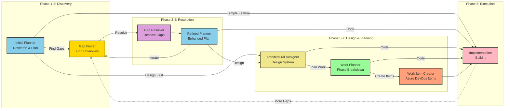
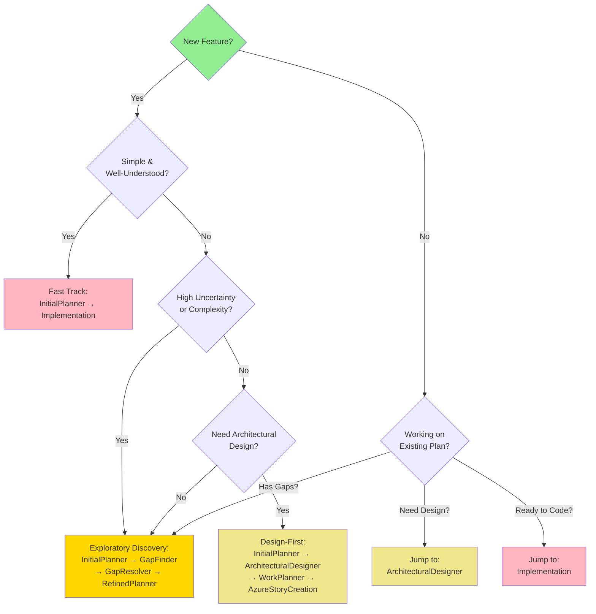

# Discovery Pipeline - Quick Reference

A visual guide to navigating the 8-agent discovery workflow system.

## Visual Workflow Map

## Agent Quick Reference

| # | Agent | Purpose | Tools | Next Step Options |
|---|-------|---------|-------|-------------------|
| 1 | **InitialPlanner** | Create first plan | Read-only | GapFinder, ArchitecturalDesigner, Implementation |
| 2 | **GapFinder** | Find unknowns | Read/Write | GapResolver |
| 3 | **GapResolver** | Resolve gaps | Read + Create | RefinedPlanner |
| 4 | **RefinedPlanner** | Plan with resolved gaps | Read-only | GapFinder (iterate), ArchitecturalDesigner, Implementation |
| 5 | **ArchitecturalDesigner** | Design architecture | Read + Create | WorkPlanner, Implementation |
| 6 | **WorkPlanner** | Break into phases | Read + Create | AzureStoryCreation, Implementation |
| 7 | **AzureStoryCreation** | Create work items | Read + Create | Implementation |
| 8 | **Implementation** | Write code | Full access | GapFinder (re-investigate) |

## Decision Tree: Which Path Should I Take?

## Common Workflow Patterns

### 🔍 Exploratory Discovery Loop
**Use when**: High uncertainty, new domains, unclear requirements

**Path**: Initial Planner → Gap Finder → Gap Resolver → Refined Planner → Implementation

**Key Feature**: Iterative gap discovery - can loop back to Gap Finder multiple times

---

### 🏗️ Design-First Approach
**Use when**: Major architectural changes, new subsystems, refactors

**Path**: Initial Planner → Architectural Designer → Work Planner → Work Item Creator → Implementation

**Key Feature**: Structured design and work breakdown before coding

---

### 🔄 Gap-Driven Iteration
**Use when**: Deep technical exploration, unknown unknowns expected

**Path**: Initial Planner → Gap Finder → Gap Resolver → Refined Planner → Gap Finder (again) → Gap Resolver (again) → Refined Planner (final) → Implementation

**Key Feature**: Multiple discovery-resolution cycles for deep exploration

---

### ⚡ Fast Track
**Use when**: Simple features, bug fixes, well-understood work

**Path**: Initial Planner → Implementation

**Key Feature**: Minimal planning overhead for straightforward tasks

---

### 🎯 Direct Implementation
**Use when**: Extremely simple changes, clear requirements, no planning needed

**Path**: Implementation

**Key Feature**: Skip planning entirely for trivial changes

## Handoff Cheat Sheet

### From Initial Planner, I can go to:
- **Gap Finder** - Discover what I don't know
- **Architectural Designer** - Design the system architecture
- **Implementation** - Code it now (simple features)
- **Open in Editor** - Save plan for refinement

### From Gap Finder, I can go to:
- **Gap Resolver** - Resolve the gaps I found

### From Gap Resolver, I can go to:
- **Refined Planner** - Create new plan with resolved gaps

### From Refined Planner, I can go to:
- **Gap Finder** - Find more gaps (iterate)
- **Architectural Designer** - Design the architecture
- **Implementation** - Code with resolved knowledge
- **Open in Editor** - Save refined plan

### From Architectural Designer, I can go to:
- **Work Planner** - Break design into work phases
- **Implementation** - Code from the design

### From Work Planner, I can go to:
- **Work Item Creator** - Generate Azure DevOps items
- **Implementation** - Code from the work plan

### From Work Item Creator, I can go to:
- **Implementation** - Execute the work items

### From Implementation, I can go to:
- **Gap Finder** - Re-investigate if I hit unknowns

## Tool Access Summary

| Agent | Search | Edit | Create | Full Access |
|-------|--------|------|--------|-------------|
| InitialPlanner | ✅ | ❌ | ❌ | ❌ |
| GapFinder | ✅ | ✅ | ✅ | ❌ |
| GapResolver | ✅ | ❌ | ✅ | ❌ |
| RefinedPlanner | ✅ | ❌ | ❌ | ❌ |
| ArchitecturalDesigner | ✅ | ❌ | ✅ | ❌ |
| WorkPlanner | ✅ | ❌ | ✅ | ❌ |
| AzureStoryCreation | ✅ | ❌ | ✅ | ❌ |
| Implementation | ✅ | ✅ | ✅ | ✅ |

## When to Loop Back

### Discover More Gaps
If refined planning or implementation reveals new unknowns → **Return to Gap Finder**

### Architectural Concerns
If implementation hits design questions → **Return to Architectural Designer**

### Scope Expansion
If feature grows beyond original plan → **Return to Refined Planner**

### Work Breakdown Issues
If work items don't cover all aspects → **Return to Work Planner**

## Pro Tips

### 💡 Start with Initial Planner
Unless you know exactly what you're doing, always start here. It sets the foundation.

### 💡 Don't Skip Gap Discovery for Complex Features
The time invested in Gap Finder pays off exponentially in reduced bugs and refactors.

### 💡 Use Handoff Buttons
They're your navigation system - click them instead of manually switching agents.

### 💡 Iterate When Needed
It's OK to loop: Plan → Find Gaps → Resolve → Refined Plan → Find More Gaps

### 💡 Read Artifact Files
Gap findings, resolutions, and designs persist across sessions - reference them!

### 💡 Combine Paths
You can mix patterns - e.g., Exploratory Discovery + Design-First

## File Artifacts Created

| Agent | Creates |
|-------|---------|
| GapFinder | `gap-findings.md` |
| GapResolver | `gap-resolutions.md` |
| ArchitecturalDesigner | `architectural-design-[name].md` |
| WorkPlanner | `work-plan-[name].md` |
| AzureStoryCreation | `work-items-[name].md` |

## Getting Help

1. **Start**: Choose Initial Planner from agent dropdown
2. **Navigate**: Use handoff buttons to move between phases
3. **Iterate**: Loop back to earlier phases if needed
4. **Reference**: Check `planning-pipeline.md` for detailed documentation

---

**Quick Start**: Open Chat → Select "InitialPlanner" → Describe your feature → Follow handoff buttons

**Need Help?**: See `planning-pipeline.md` for comprehensive guide
