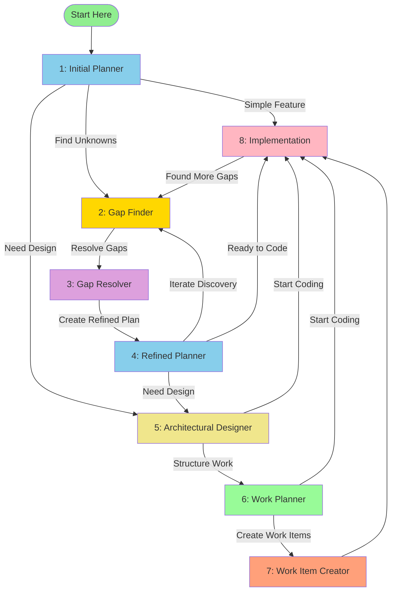

# Planning Pipeline

A multi-agent workflow system for VS Code Copilot that transforms complex feature development from uncertain exploration into systematic discovery, planning, and execution.

## Overview

The Planning Pipeline is an 8-phase system that guides you from initial feature ideas through gap discovery, architectural design, and work planning. Each agent specializes in a specific phase and uses handoffs to create guided sequential workflows that put you in control.

### The Core Philosophy

**Discover what you don't know BEFORE committing to implementation.**

Traditional development often leads to mid-implementation surprises, requirements gaps, and costly refactors. This pipeline frontloads discovery through systematic gap finding and resolution, reducing future bugs and rework.

## The 8 Agents

### Phase 1: Initial Planner
**File**: `01-InitialPlanner.agent.md`  
**Purpose**: Research and outline initial implementation plans for complex features  
**Tools**: Read-only (search, usages, problems, fetch, githubRepo, runSubagent)  
**Handoffs**: GapFinder, ArchitecturalDesigner, Implementation

Creates initial plans through comprehensive research and clarifying questions. Entry point for new features.

---

### Phase 2: Gap Finder
**File**: `02-GapFinder.agent.md`  
**Purpose**: Discover knowledge gaps through implementation attempts  
**Tools**: Read/write (search, edit, createFile, usages, problems, changes)  
**Handoffs**: GapResolver

Attempts implementation to uncover unknowns. Treats obstacles as intelligence, not failures. Documents all gaps systematically.

---

### Phase 3: Gap Resolver
**File**: `03-GapResolver.agent.md`  
**Purpose**: Resolve discovered gaps through collaborative dialogue  
**Tools**: Read-only + file creation (search, createFile, usages, problems, fetch)  
**Handoffs**: RefinedPlanner

Works with you to systematically resolve each gap through targeted questions. Creates enhanced prompts with all ambiguities eliminated.

---

### Phase 4: Refined Planner
**File**: `04-RefinedPlanner.agent.md`  
**Purpose**: Create refined plans using resolved gap information  
**Tools**: Read-only (search, usages, problems, fetch, githubRepo, runSubagent)  
**Handoffs**: GapFinder (iterate), ArchitecturalDesigner, Implementation

Creates new plans leveraging gap resolutions. More confident and detailed than initial plans.

---

### Phase 5: Architectural Designer
**File**: `05-ArchitecturalDesigner.agent.md`  
**Purpose**: Create high-level architectural designs and technical documentation  
**Tools**: Read-only + file creation (search, createFile, usages, problems, fetch, githubRepo)  
**Handoffs**: WorkPlanner, Implementation

Designs system architecture emphasizing testability, separation of concerns, and maintainability. Creates design documentation.

---

### Phase 6: Work Planner
**File**: `06-WorkPlanner.agent.md`  
**Purpose**: Break down features into development phases with dependencies  
**Tools**: Read-only + file creation (search, createFile, usages, problems, fetch)  
**Handoffs**: `@AzureStoryCreation`, Implementation

Creates phased work breakdown identifying parallel development opportunities and critical paths.

---

### Phase 7: Work Item Creator

> **Note**: Work item creation has been extracted into the standalone `AzureStoryCreation` agent with its own skill and format conventions. Use `@AzureStoryCreation` after completing your work plan rather than an inline pipeline phase.

Transforms work plans into structured Azure DevOps user stories with clear acceptance criteria and dependencies.

---

### Phase 8: Implementation
**File**: `08-Implementation.agent.md`  
**Purpose**: Execute implementation with full editing capabilities  
**Tools**: Full access (all standard development tools)  
**Handoffs**: GapFinder (re-investigate)

The execution phase. Implements features based on accumulated knowledge from prior phases.

## Workflow Paths

## Common Workflow Patterns

### Exploratory Discovery Loop (Complex Features)
**Best for**: Features with high uncertainty, new domains, or unclear requirements

1. **Initial Planner** → Create initial plan
2. **Gap Finder** → Attempt implementation, discover unknowns
3. **Gap Resolver** → Resolve all gaps with user
4. **Refined Planner** → Create confident plan with resolved knowledge
5. **Implementation** → Execute with minimal surprises

**When to use**: Complex features, new technical domains, integrations with unclear APIs

---

### Design-First Approach (Architectural Features)
**Best for**: Features requiring significant architectural changes or new system components

1. **Initial Planner** → Understand feature scope
2. **Architectural Designer** → Design high-level architecture
3. **Work Planner** → Break into development phases
4. **Work Item Creator** → Create trackable work items
5. **Implementation** → Execute with clear roadmap

**When to use**: Major refactors, new subsystems, architectural changes

---

### Gap-Driven Iteration (Iterative Discovery)
**Best for**: Features where unknowns emerge during planning

1. **Initial Planner** → First pass plan
2. **Gap Finder** → Discover unknowns
3. **Gap Resolver** → Resolve gaps
4. **Refined Planner** → Second pass plan
5. **Gap Finder** (again) → Discover deeper unknowns
6. **Gap Resolver** (again) → Resolve new gaps
7. **Refined Planner** (again) → Final confident plan
8. **Implementation** → Execute

**When to use**: Deep technical exploration, research-heavy features

---

### Fast Track (Simple Features)
**Best for**: Well-understood, straightforward features

1. **Initial Planner** → Quick plan
2. **Implementation** → Direct execution

**When to use**: Bug fixes, small enhancements, routine features

## Entry Points

### Starting a New Feature
→ **Initial Planner** (Phase 1)

### Investigating an Existing Plan
→ **Gap Finder** (Phase 2)

### Designing Architecture
→ **Architectural Designer** (Phase 5)

### Creating Work Items from Design
→ **Work Item Creator** (Phase 7)

## Key Benefits

### Reduced Bugs
Discover ambiguities before coding, not during QA.

### Fewer Refactors
Make architectural decisions with full knowledge of requirements.

### Better Estimates
Work items based on gap-resolved plans are more accurate.

### Knowledge Capture
Gap resolutions and designs become documentation for future work.

### Flexible Workflow
Choose your path in real-time based on feature complexity and confidence.

## Getting Started

1. **Open Chat** and select `InitialPlanner` from the agent dropdown (or type `@InitialPlanner`)
2. **Start Simple**: Describe the feature you want to build — Initial Planner handles the rest
3. **Follow Handoffs**: Use the handoff buttons to move between pipeline phases
4. **Iterate**: Don't hesitate to go back to Gap Finder if you discover new unknowns
5. **Create Work Items**: After work planning, use `@AzureStoryCreation` to convert the plan into Azure DevOps stories

## File Artifacts

Throughout the pipeline, agents create documentation files:

- `gap-findings.md` - Documented knowledge gaps from Gap Finder
- `gap-resolutions.md` - Resolved gaps and decisions from Gap Resolver
- `architectural-design-[name].md` - Architecture documentation from Architectural Designer
- `work-plan-[name].md` - Phased work breakdown from Work Planner
- `work-items-[name].md` - Azure DevOps work items from Work Item Creator

These artifacts persist across chat sessions and provide traceability.

## Tips for Success

### Trust the Process
The pipeline may feel slower initially, but it prevents costly late-stage surprises.

### Use Handoffs Liberally
The handoff buttons are your navigation system - use them to jump between phases.

### Don't Skip Gap Discovery
For complex features, always run Gap Finder. The time invested pays off exponentially.

### Iterate When Needed
It's OK to loop: Plan → Find Gaps → Resolve → Refined Plan → Find More Gaps → Resolve → Final Plan

### Combine with Existing Workflows
The pipeline complements, not replaces, your existing development practices.

## Advanced Usage

### Custom Agent Names
All agents are numbered (01-08) for clarity but can be referenced by name (e.g., `GapFinder` instead of `02-GapFinder`).

### Modifying Agents
Each agent is a `.agent.md` file. Customize instructions, tools, or handoffs to fit your workflow.

### Adding Agents
Extend the pipeline with additional agents (e.g., CodeReviewer, TestGenerator) following the same XML + Markdown format.

## Lessons Learned

The planning pipeline does not currently have a dedicated Lessons Learned file. Accumulated knowledge for related features lives alongside their respective skills:

- `creating-azure-stories` skill → `skills/creating-azure-stories/LessonsLearned.md` (work item formatting patterns, common mistakes)
- `writing-csharp-tests` skill → `skills/writing-csharp-tests/LessonsLearned.md` (patterns relevant during implementation)

If recurring pipeline-level patterns emerge (e.g., gap discovery strategies, common planning mistakes), add a `LessonsLearned.md` alongside this file.
